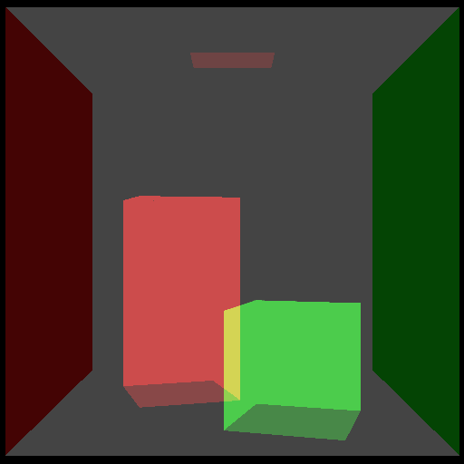
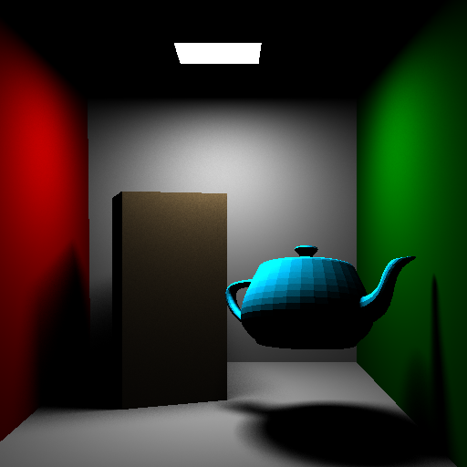

# HIPRT

## 项目说明

当前仓库保留 `HIPRT` 项目名称以及 `hiprt*` 对外 API 命名，但主实现已经围绕 **CUDA-only + MACA/cu-bridge** 路径完成重构与验证。

当前状态：

- 保留：
  - `hiprt.h`
  - `hiprtew.h`
  - `hiprtCreateContext`
  - `hiprtBuildTraceKernels`
  - `hiprtBuildTraceKernelsFromLinkedBundle`
- 去除：
  - AMD HIP runtime 主路径
  - ROCm toolchain 依赖
  - 历史 HIP loader 主路径
- 当前主推荐构建：
  - 原生 CUDA：`CMake + CUDA Toolkit`
  - MACA：`cmake_maca + make_maca`

## 快速构建

原生 CUDA：

```bash
cmake -S . -B build -DCMAKE_BUILD_TYPE=Release
cmake --build build --config Release -j
```

MACA/cu-bridge：

```bash
./scripts/build_maca_cucc.sh
```

常用一键脚本：

```bash
./scripts/build.sh
./scripts/build_and_test.sh
./scripts/unittest_maca_cucc_precompiled.sh
```

更完整的中文说明：

- `docs/cuda-only-build-zh.md`
- `docs/bitcode-status-zh.md`
- `docs/main-maca-fix-notes-zh.md`
- `docs/main-vs-upstream-classification-zh.md`
- `docs/mxcc-offline-progress-zh.md`
- `docs/mxcc-offline-plan-zh.md`

## 当前能力概览

- `MACA + cu-bridge` 主路径已完成基础功能验证
- `bitcode / precompile / bake_kernel` 已恢复
- source-based 官方 API 在 `mxcc` 路径下，默认已切到当前已验证的 `maca-link bundle` 行为
- `linked bundle` 也提供了显式 public API：
  - `hiprtBuildTraceKernelsFromLinkedBundle(...)`

## 关键示例效果

以下图片来自当前仓库联动 `HIPRTSDK` 跑通后的真实结果：

### 1. Geometry Intersection


### 2. Custom Intersection


### 3. Custom BVH Import



### 4. Cutout / Filter


### 5. Shadow Ray



### 6. Primary Ray


## About 
HIP RT is a low-level ray tracing library. This repository now targets a CUDA/NVRTC runtime path and no longer depends on HIP toolchains, HIP runtime loaders, or compatibility layers.

Although there are other ray tracing APIs which introduce many new things, we designed HIP RT in a slightly different way so you do not need to learn many new kernel types.

Released binaries can be found at [HIP RT page under GPUOpen](https://gpuopen.com/hiprt/).
HIP RT library is developed and maintained by ARR, [Advanced Rendering Research Group](https://gpuopen.com/advanced-rendering-research/). 

## Development

This is the main repository for the source code for HIPRT.

## Current Status

- The public project name remains `HIPRT`, and public API names such as `hiprtCreateContext` are intentionally preserved.
- The backend is now CUDA-only. AMD HIP runtime, ROCm toolchains, `hipcc`, and historical HIP loader paths are not part of the build anymore.
- `hiprtew.h` is kept as a compatibility header, but it now calls linked HIPRT APIs directly instead of resolving symbols at runtime.
- The vendored `contrib/Orochi` subtree has been trimmed to the pieces still needed by the current build. Historical HIP loader code, Orochi tests, and Orochi helper scripts are no longer kept in the repository.

For a concise Chinese description of the current build and migration boundaries, see `docs/cuda-only-build-zh.md`.

## Current Main MACA Status

For the current `main` branch on `MACA + cu-bridge`:

- The local non-performance test suite currently visible on `main` passes `62 / 62`.
- This result has been verified both with runtime kernel disk cache disabled and with runtime kernel disk cache enabled.
- The cache-enabled verification used:
  - `cmake_maca`
  - `make_maca`
  - `HIPRT_ENABLE_RUNTIME_KERNEL_CACHE=ON`
  - `HIPRT_DISABLE_RUNTIME_KERNEL_CACHE=0`

This `62 / 62` suite includes the additional diagnostics and regression tests previously kept on `maca_dev`, such as:

- scene transform / traversal diagnostics
- recreate / lifecycle diagnostics
- batch geometry diagnostics
- focused no-reference regressions used as red/green guards

For the detailed Chinese notes of the current `main`-branch MACA fixes and validation scope, see `docs/main-maca-fix-notes-zh.md`.

## Cloning and Building 

1. `git clone https://github.com/GPUOpen-LibrariesAndSDKs/HIPRT.git`
2. `cd HIPRT`
3. `git submodule update --init --recursive`
4. `git lfs fetch` (To get resources for running performance tests)

Build with CMake only.

&nbsp;&nbsp;&nbsp;Example on Windows:
&nbsp;&nbsp;&nbsp;5. `cmake -S . -B build -DCMAKE_BUILD_TYPE=Release`
&nbsp;&nbsp;&nbsp;6. `cmake --build build --config Release`

&nbsp;&nbsp;&nbsp;Example on Linux:
&nbsp;&nbsp;&nbsp;5. `cmake -S . -B build -DCMAKE_BUILD_TYPE=Release`
&nbsp;&nbsp;&nbsp;6. `cmake --build build --config Release -j`

### Build Notes

- `CUDAToolkit` is required. CMake configures the project in CUDA mode only.
- `CMAKE_CUDA_ARCHITECTURES` is cache-configurable. Example: `cmake -S . -B build -DCMAKE_BUILD_TYPE=Release -DCMAKE_CUDA_ARCHITECTURES=89`.
- Unit tests are built by default. Disable them with `-DNO_UNITTEST=ON`.
- Generated binaries are written to `dist/bin/<Config>/`.
- Optional bitcode / precompile switches:
  - `-DHIPRT_ENABLE_BAKE_KERNEL=ON`: generate `hiprt/cache/Kernels.h` and `hiprt/cache/KernelArgs.h`
  - `-DHIPRT_ENABLE_BITCODE=ON`: generate `hiprt<ver>_nv_lib.fatbin` and `hiprt<ver>_nv.fatbin`
  - `-DHIPRT_ENABLE_PRECOMPILED_TRACE_KERNEL=ON`: generate `hiprt<ver>_nv_precompiled_bitcode.fatbin`

## Current Bitcode / Precompile Status

- `bake_kernel` has been restored through `HIPRT_ENABLE_BAKE_KERNEL`.
- The CUDA/cu-bridge build can now generate the HIPRT precompiled fatbin artifacts and a precompiled trace-kernel fatbin through `scripts/bitcodes/compile.py` and `scripts/bitcodes/precompile_bitcode.py`.
- `hiprtBuildTraceKernelsFromBitcode(...)` has been re-enabled for CUDA-side PTX/CUBIN linking against the generated `hiprt*_nv_lib.fatbin`.
- On `MACA + cu-bridge`, the recommended path is still the precompiled workflow. Runtime `nvrtc --device-c` emission for user trace kernels is not yet stable enough to use as the primary validation path, so the related UTs are skipped on cu-bridge and the precompiled artifacts are the supported validation route there.
- The precompiled validation route is covered by UTs that directly load the generated `hiprt*_nv_precompiled_bitcode.fatbin`, resolve both `TraceKernel` and `CutoutKernel`, and launch both the plain trace path and the custom-func-table path on minimal test scenes.
- On the current machine, native CUDA runtime-bitcode validation is still pending because there is no native `nvcc` / standalone CUDA toolkit installed; the validated completed path here is the MACA precompiled workflow.
- For the current experimental `mxcc --maca-link` route, see:
  - `scripts/bitcodes/build_mxcc_trace_bundle.py`
  - `scripts/bitcodes/mxcc_maca_link_probe.sh`
  - `scripts/bitcodes/mxcc_maca_link_trace_probe.sh`
  - `docs/mxcc-offline-progress-zh.md`
- For source-based usage on the current `mxcc` path, the default behavior now prefers the validated `mxcc -c + --maca-link -fatbin + cuModuleLoadData` route rather than the older `cuLinkAddData` path.
- If users want an explicit route instead of the default source path, `hiprtBuildTraceKernelsFromLinkedBundle(...)` is available as the direct public entry for already linked bundles.

For the detailed Chinese status and current MACA constraints, see `docs/bitcode-status-zh.md`.

## Running Unit Tests

There are three types of tests. 
1. HiprtTests           - tests covering all basic features.
2. ObjTestCases         - tests with loading meshes and testing advanced features like shadow/ AO.
3. PerformanceTestCases - tests with complex mesh to test performance features.

Example: `..\dist\bin\Release\unittest64.exe --width=512 --height=512 --referencePath=.\references\ --gtest_filter=hiprt*:Obj*" `

Linux helper scripts:
- `cd scripts && ./unittest.sh`
- `cd scripts && ./unittest_perf.sh`

## Developing HIPRT

### Coding Guidelines
- Resolve compiler warnings.
- Use lower camel case for variable names (e.g., `nodeCount`) and upper camel case for constants (e.g., `LogSize`).
- Separate functions by one line.
- Use prefix `m_` for non-static member variables.
- Do not use static local variables.
- Do not use `void` for functions without arguments (leave it blank).
- Do not use blocks without any reason.
- Use references instead of pointers if possible.
- Use bit-fields instead of explicit bit masking if possible.
- Use `nullptr` instead of `NULL` or zero.
- Use `using` instead of `typedef`.
- Use C++-style casts (e.g., `static_cast`) instead of C-style cast.
- Add `const` for references and pointers if they are not being changed.
- Add `constexpr` for variables and functions if they can be constant in compile time (do not use `#define` if possible).
- Use `if constsexpr` instead of `#ifdef` if possible.
- Throw `std::runtime_error` with an appropriate message in case of failure in the core and catch it in `hiprt.cpp`.

#### String
- Use `std::string` instead of C strings (i.e., `char*`) and avoid C string functions as much as possible.
- Use `std::cout` and `std::cerr` instead of `printf`.
- Do not assign `char8_t` (or `std::u8string`) to `char` (or `std::string`). They will not be compatible in C++20.

#### File
- Use `std::ifstream` and `std::ofstream` instead of `FILE`.
- Use `std::filesystem::path` for files and paths instead of `std::string`.

#### Class
- Use the in-class initializer instead of the default constructor.
- Use the keyword `override` instead of `virtual` (or nothing) when overriding a virtual function from the base class.
  - Reason: The `override` keyword can help prevent bugs by producing compilation errors when the intended override is not actually implemented as an override. For example, when the function type is not exactly identical to the base class function. This can be caused by mistakes or if the virtual functions in the base class are changed due to refactor.
- Use `std::optional` instead of pointers for optional parameters.
  - Reason: `std::optional` guarantees that no auxiliary memory allocation is needed. Meaning, it does not involve dynamic memory allocation & deallocation on the heap, which results in better performance and less memory overhead.
- A base class destructor should be either public and virtual, or protected and non-virtual
  - Reason: This is to prevent undefined behavior. If the destructor is public, then the calling code can attempt to destroy a derived class object/instance through a base class pointer, and the result is undefined if the base class’s destructor is non-virtual.
- Implement the customized {copy/move} {constructor/assignment operator} if an user-defined destructor of a class is needed, or remove them using `= delete`
  - Reason: [Rule of five](https://en.cppreference.com/w/cpp/language/rule_of_three)

### Versioning
- When we update the master branch, we need to update the version number of hiprt in `version.txt`.
- If there is a change in the API, you need to update minor version. 
- If the major and minor versions matches, the binaries are compatible. 
- Each commit in the master should have a unique patch version. 
